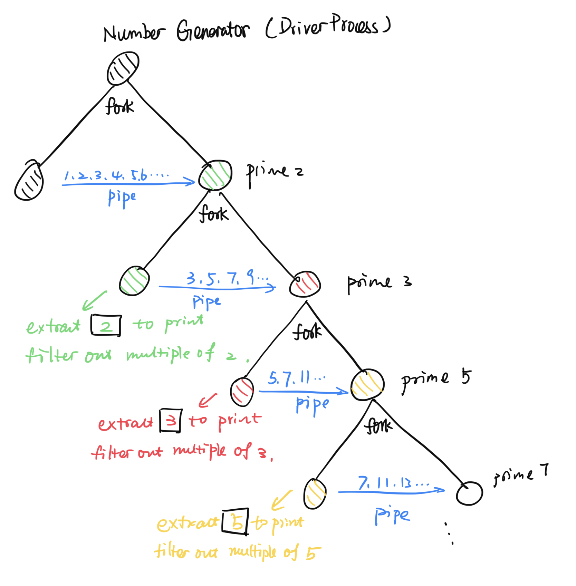

# <center> Notes on Primes </center>

<center><b> Use of wait in the context of piping </b></center>
<center><i> This is a key to correctly writing the prime program </i></center>

Consider the following program:
```c
int main()
{
    int fd[2];
    pipe(fd);
    if (fork())
    {
        close(fd[0]);
        int buf[] = {1,2,3,4,5};
        for (int i = 0; i < 5; i++)
            write(fd[1],buf + i,sizeof(int));
        wait(0);
    }
    else
    {
        close(fd[1]);
        int i = 0;
        while(read(fd[0],&i,sizeof(i)))
            printf("%d\n", i);
    }
}
```
The parent process throws whatever's in the buffer to the pipe, from which the child process receives one integer at a time through a while loop. To prevent the creation of zombie processes, we have the parent wait for the child by adding wait(0); however, just due to that wait statement, the parent is unfortunately not able to exit since it's waiting for the child process to exit, while the child process never exits because it can't break the while loop. The reason is that the child can only break that loop when all the input ends of the pipes are closed (including input ends towards the pipe of its own as well as its parent's), indicating no more writing, and then the child process can happily read off whatever's left in the pipe and encounters the EOF condition, for which read function returns 0 to break the while loop.

To make the code work, we can do the following modification:
```c
if (fork())
    {
        close(fd[0]);
        int buf[] = {1,2,3,4,5};
        for (int i = 0; i < 5; i++)
            write(fd[1],buf + i,sizeof(int));
        close(fd[1]);                        // CLOSE INPUT END OF PIPE
        wait(0);
    }
```

<center><b> Primes </b></center>

This image well expalines the main logic of the prime program, and, in the process tree, every two nodes of the same color represents the same process.

<center>
 
</center>
